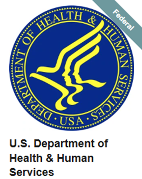
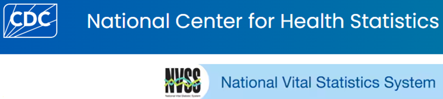
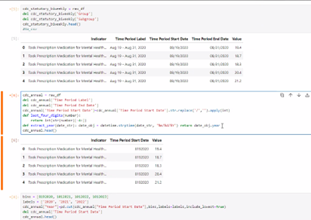
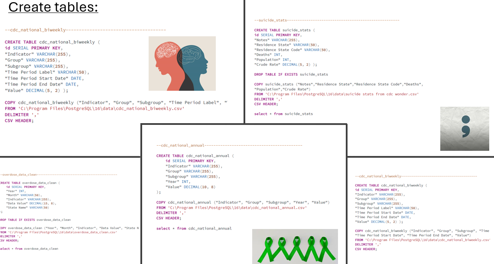
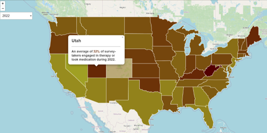

# ku_bootcamp_project3

# Mental Health Snapshot 2020-2022

## Overview
Our team chose the data visualization track and focused on mental health and substance use disorders(SUD). Mental health and SUD are important drivers for our community and community public health. The U.S. Department of Health and Human Services (DHH) can use the information to help spread awareness, increase services where needed, and potentially help reduce the suicide rate in the U.S. It is a topic that we can break the stigma about if we educate ourselves and others with data.

We analyzed data in the U.S. from 2020 – 2022 in the upcoming specified areas of mental health. We were curious mostly about the impact COVID-19 pandemic had on mental health. We analyzed it in three areas; overdose rates, suicide rates, and mental health services received. Mental health services were categorized in four areas all specific to the last four week ; (1) took prescription medication for mental health, (2) received counseling for mental health, (3) took prescription medication for mental health AND received counseling, (4) needed counseling but did not get it.

### Questions we asked ourselves
How do the states compare regarding mental health engagement?

How did suicide rates change during the time frame?

How do states compare regarding overdose rates during the time frame?

#### Datasets pursued

1. Mental health care in the last four weeks (4 areas)
2. Suicide data
3. Overdose data
 
 

 
 

### PostgreSQL database is used to house the data 

### Libraries pursued: Leaflet, Plotly, Pandas, Chart.js

(State coordinates were found here: https://leafletjs.com/examples/choropleth/us-states.js)

## To interact with the project

https://levifahring.github.io/ku_bootcamp_project3/Project%203/Scripts/us_state_map/index.html

## Ethical Consideration
When presenting a project about mental health and SUD, it is crucial to approach the topic with sensitivity and ethical responsibility. First and foremost, it's essential to prioritize the mental health and well-being of the audience by providing content that is informative yet respectful, avoiding sensationalism or graphic details that could trigger distress. Clear content warnings should be included to prepare viewers for potentially distressing topics. Additionally, it is important to ensure accuracy in the information presented, drawing from credible sources and research to avoid spreading misinformation. Lastly, fostering an open dialogue that encourages understanding and compassion can help create a supportive environment, allowing individuals to engage with the subject matter thoughtfully and empathetically.

